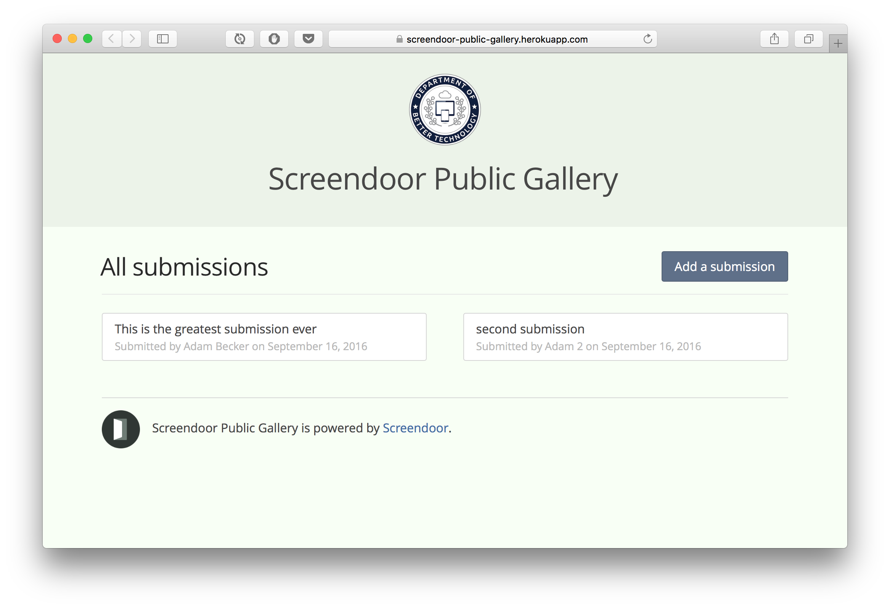

Screendoor Public Gallery
====

This is a prototype of a "public gallery" function for Screendoor, implemented using the [Screendoor API](http://dobtco.github.io/screendoor-api-docs/).

## How you might use it

- Displaying your Screendoor responses to the general public (Included)
- Soliciting public comments on your Screendoor responses (Included, via Disqus widget)
- Hosting a public voting period for your Screendoor responses (Not yet included)

## Technical Details

This is a simple Rails 4 app. Its only dependency is a Postgres database.

There are some environment variables that you must set. Copy `.env.example` to `.env`, and fill them in.

To install dependencies, run `bundle install`. To run the site, run `bundle exec rails server`.

This site can be easily deployed to Heroku without any additional configuration.

## License

MIT
